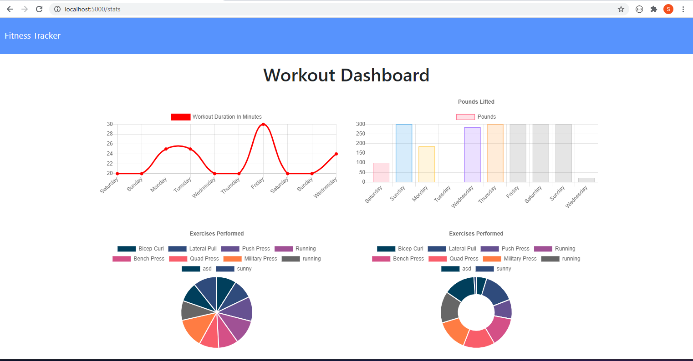

# Workout-Tracker

## Description

A web app for tracking your workouts day in and day out.

With workout tracker a user can pickup where they left off on their last workout or log a new workout. The user can add multiple exercises to their workout before completing the workout.

When a user visits their dashboard, they are presented with four charts:

* Graph that tracks how much time in minutes you spent working out day by day.
* Graph that tracks how much wight in pounds you you lifted working out day by day.
* Pie chart that shows the exercises completed by time.
* Pie chart that shows the exercises completed by weight.

## Technologies and Features

Technologies

* Node.js
* MongoDB
* Mongoose
* Express

## User Story
```
AS Gym goer
I WANT to be able to view create and track daily workouts. 
I want to be able to log multiple exercises in a workout on a given day. 
I should also be able to track the name, type, weight, sets, reps, and duration of exercise. 
If the exercise is a cardio exercise, I should be able to track my distance traveled.
SO THAT I can track my progress over time

```

## Installation
1. `npm i`
1. `node seeders/seed.js`
1. `node server.js`


## Screenshots

1. Main Page


2. Add a new workout


3. Dashbord

